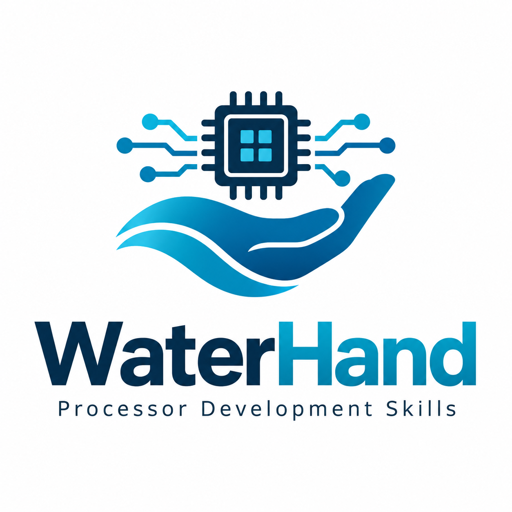

# WaterHand Processor Development Skills

  

把处理器工程经验封装为可复用的 Skill，扩大个人和小团队设计者的产出带宽。

一次微架构修改往往牵连设计文档、模块接口、流水线控制、源码和测试。WaterHand 将这些工作中积累的阅读方法、分析步骤、典型缺陷和检查要求整理成六项 Skill，供 Codex 在具体项目中按需使用。设计者负责目标、架构取舍和结果接受，Agent 承担获准的分析、修改与验证工作。

这些方法来自处理器开发实践，适用于课程项目、科研原型和已有 Chisel 工程。处理器的设计事实、源码和验证记录始终保存在使用者自己的项目中。

## 六项 Skill

| Skill | 用途 |
|---|---|
| [bootstrap-processor-project](skills/bootstrap-processor-project/SKILL.md) | 建立项目根目录的 `AGENTS.md`，明确事实归属、授权和工具入口 |
| [organize-processor-docs](skills/organize-processor-docs/SKILL.md) | 组织设计文档，维护模块、协议、验证材料之间的阅读路径 |
| [design-chisel-processor](skills/design-chisel-processor/SKILL.md) | 审查和完善微架构设计，核对接口、周期行为和状态生命周期 |
| [implement-chisel-processor](skills/implement-chisel-processor/SKILL.md) | 根据已确认设计实现 Chisel RTL，同步源码说明、断言和测试 |
| [trace-vivado-timing-to-rtl](skills/trace-vivado-timing-to-rtl/SKILL.md) | 从 Vivado 时序证据追踪到 RTL、Chisel 源码和流水级 |
| [optimize-chisel-fpga-timing](skills/optimize-chisel-fpga-timing/SKILL.md) | 构造时序优化候选，通过功能验证和物理实现比较结果 |

## 开始使用

[用户指南](USER_GUIDE.md)介绍加载方式、每项 Skill 的输入和调用示例，并配有实际工程截图。可以先从已有项目的一次设计审查开始，再按需要组合使用。

Codex 提供模型调用、会话、文件编辑和工具执行能力。编译、仿真、综合环境及其命令由用户项目维护；Skill 自带的文档检查器和时序报告提取脚本随对应目录提供。发布文件见 [GitHub Releases](https://github.com/sixblade325/WaterHand-Processor-Development-Skills/releases)。

## 历史报告

`report/` 保留 2026 年 9 月竞赛提交的三份 PDF，供了解项目的设计思路和当时的实验结果：

- [作品简介](report/作品简介.pdf)
- [设计文档](report/设计文档.pdf)
- [实验补充说明](report/实验补充说明.pdf)

报告按提交时的状态保留。其中涉及的 Windows Execution Support Kit 已于 2026 年 10 月 3 日移除。当前交付内容和用法以本 README、用户指南及各项 `SKILL.md` 为准；实验结论按报告注明的模型、环境、输入基线和验证范围理解。

## 许可证

本仓库的 Skill、脚本、模板和文档采用 [木兰宽松许可证，第 2 版](LICENSE)，标识为 `MulanPSL-2.0`。另有标注的第三方材料、外部工具和用户处理器项目遵循各自的许可证。
