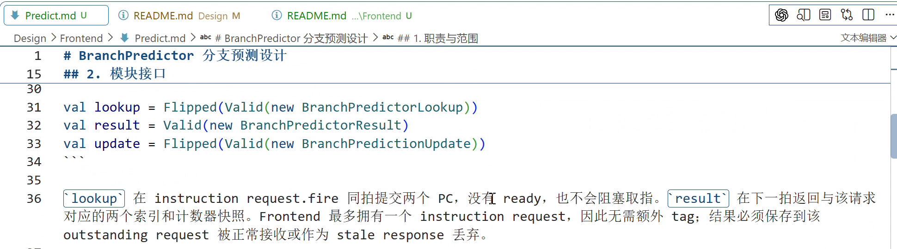
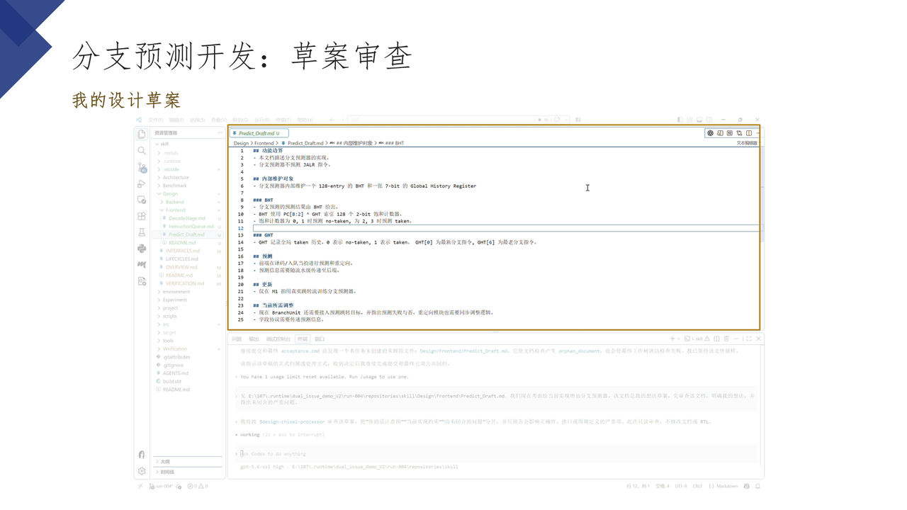
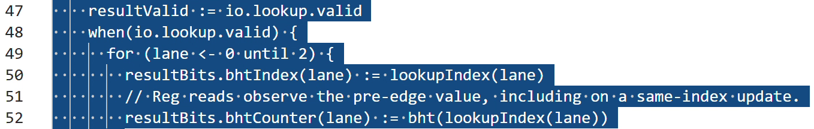
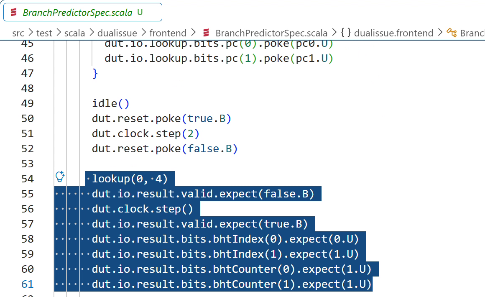
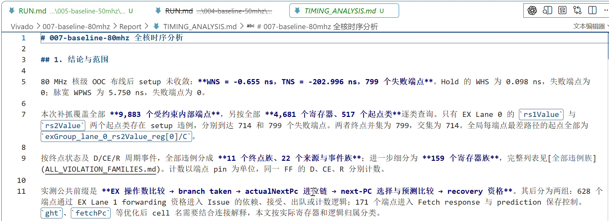
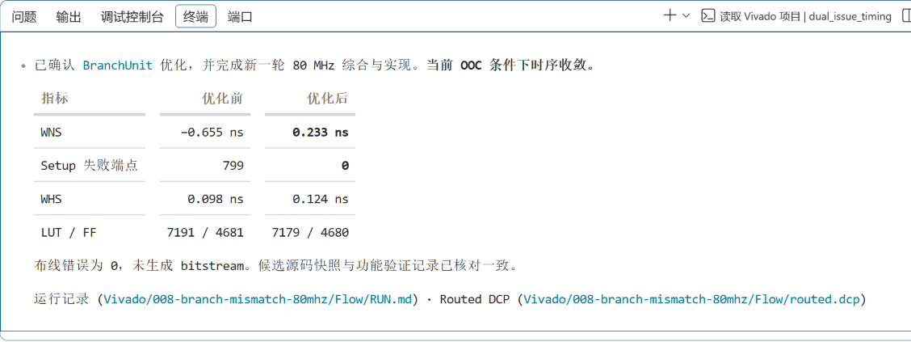

# WaterHand 使用指南

本指南介绍六项 Skill 的使用场景、准备材料和交付结果。示例以 Chisel 处理器项目为背景，文档路径需要按自己项目的实际布局替换。

- [加载与准备](#加载与准备)
- [建立项目协作规则](#建立项目协作规则)
- [组织工程文档](#组织工程文档)
- [设计与审查微架构](#设计与审查微架构)
- [实现与验证 Chisel RTL](#实现与验证-chisel-rtl)
- [追踪 Vivado 时序路径](#追踪-vivado-时序路径)
- [优化 FPGA 时序](#优化-fpga-时序)
- [组合使用](#组合使用)

文中的截图和动画来自 2026 年 9 月的实际工程材料，展示当时的对话、文档和结果。画面中的 Windows 路径及工程命令属于案例环境，当前使用时遵循自己项目的工具入口。[素材说明](assets/user-guide/README.md)记录了各图的来源与范围。

## 加载与准备

从 [Releases](https://github.com/sixblade325/WaterHand-Processor-Development-Skills/releases) 下载并解压 Skill 包，或获取 `opensource` 分支：

```sh
git clone --branch opensource https://github.com/sixblade325/WaterHand-Processor-Development-Skills.git
```

在目标处理器项目中创建 `.agents/skills/`，将本包 `skills/` 下需要使用的完整 Skill 目录复制进去。保留其中的 `references/`、`assets/`、`scripts/` 和 `agents/` 等配套内容。例如：

```text
your-processor/
├── .agents/
│   └── skills/
│       ├── design-chisel-processor/
│       │   ├── SKILL.md
│       │   └── references/
│       └── implement-chisel-processor/
│           ├── SKILL.md
│           ├── agents/
│           └── references/
├── AGENTS.md
├── doc/
└── src/
```

上图省略了部分文件。复制范围是每项 Skill 的完整目录；根目录的 `AGENTS.md` 由目标项目维护。已有同名 Skill 时，先比较版本与本地修改，再决定替换范围。跨项目使用可将 Skill 放入用户级 `~/.agents/skills/`，保留一份明确维护的副本即可。

在目标项目中打开 Codex，确认所需 Skill 出现在可用列表中。CLI 或 IDE 扩展可用 `/skills` 查看，并在请求中通过 `$<skill-name>` 指定；其他界面使用其 Skill 选择入口。发现列表没有更新时重启 Codex。加载位置与调用方式依据 [OpenAI 官方 Skill 文档](https://developers.openai.com/codex/skills/)。

开始工程任务前，准备项目的 `AGENTS.md`、相关 Architecture、Design、源码和已有验证材料，并确认编译、仿真或 Vivado 的实际入口。文档组织和时序提取脚本使用 Python 3.10 或更新版本；硬件工具的版本由目标项目决定。

一次请求应让 Agent 知道任务、材料位置、允许修改的范围和完成标准。下面的写法可以直接替换其中内容：

```text
使用 $design-chisel-processor 审查分支预测草稿。
先读取项目 AGENTS.md，以及 doc/Design/Frontend 下的草稿和现有前端设计。
检查预测信息的传递、更新、恢复及停顿行为，给出具体周期反例和待决定事项。
本次保持文件只读。
```

后续决定已经写入正式文档时，直接指出其路径，供 Agent 继续工作。源码、测试和工具输出分别提供实现与验证证据，设计者据此判断交付是否满足目标。

## 建立项目协作规则

[`bootstrap-processor-project`](skills/bootstrap-processor-project/SKILL.md) 用于初始化项目根目录的 `AGENTS.md`。它把正式文档位置、授权边界、已有工具入口和任务 Skill 索引写在一起，便于后续会话进入项目后找到依据。

新项目可以这样请求：

```text
使用 $bootstrap-processor-project 初始化当前处理器项目的 AGENTS.md。
先读取已有目录和项目说明，登记可核验的文档路径与工具入口。
缺少既有映射时采用包内默认值，只修改根目录 AGENTS.md。
```

默认映射为 `doc/Architecture/`、`doc/Design/`、`doc/Verification/`、`src/` 和 `.runtime/`。这一步只创建规则文件；实际文档目录由后续工作按需要建立。已有项目继续使用其明确的路径映射。

项目已经维护 `AGENTS.md` 时，可以要求比较差异：

```text
使用 $bootstrap-processor-project 比较当前 AGENTS.md 与包内基线。
先列出规则缺口、冲突和增量建议，经我确认后再修改。
```

检查结果时，重点看路径和命令是否来自项目已有材料、授权规则是否完整，以及已有约束是否被保留。初始化完成后，该文件归用户项目维护，升级 Skill 时需要单独评估规则变化。

## 组织工程文档

[`organize-processor-docs`](skills/organize-processor-docs/SKILL.md) 适合文档入口难找、同一事实分散在多处，或设计修改后需要同步相关说明的情况。它按照处理器目标、具体设计、验证依据和研究材料的职责组织内容，让人和 Agent 沿相同路径阅读。

它提供三种工作方式：`Bootstrap` 建立必要的文档结构，`Author` 撰写具体文档，`Maintain` 检查和整理已有内容。使用时给出文档范围及希望解决的阅读问题，例如：

```text
使用 $organize-processor-docs 的 Maintain 模式整理前端设计文档。
按项目 AGENTS.md 的目录映射工作，保留已有模块边界和设计结论。
检查重复定义、缺失链接和过长文档，按模块组织入口，关联跨模块协议及验证材料。
涉及事实归属或目录迁移的改动先给出方案。
```

交付应能回答：某个模块在哪里介绍，接口由谁定义，相关设计如何找到源码和测试。同一规则由一处完整维护，其他位置通过摘要和链接引用。Chisel 接口先给出声明，再按字段解释语义。



上图展示案例中的文档产物。文档组织的实际调用过程没有对应录像，这张图用于说明可阅读的结果形式。

整理后可运行自带检查器。以下命令在目标项目根目录执行，假设 Skill 已按前文安装：

```sh
python .agents/skills/organize-processor-docs/scripts/check_docs.py . --json
```

检查器默认发现 `doc/` 下的文档域。项目采用其他布局时，可以重复传入 `--root`，例如 `--root Architecture --root Microarchitecture`。它检查链接、阅读深度、编码、冲突标记和长度预算；设计语义还需要结合对应文档和源码审查。

## 设计与审查微架构

[`design-chisel-processor`](skills/design-chisel-processor/SKILL.md) 适用于提出新机制、审查草稿，以及在实现前补全接口和周期行为。常见对象包括流水线、队列、发射逻辑、分支预测、Cache、MSHR、转发、唤醒和异常恢复。

给出当前设计、相关源码、目标与约束后，Agent 会追踪字段的产生、保存和消费位置，检查置位与清除条件、同周期优先级、flush、重试、晚到响应和表项复用。发现问题时，应说明触发条件并给出具体周期反例。

```text
使用 $design-chisel-processor 审查 doc/Design/Frontend/Predict_Draft.md。
结合当前 Fetch、Decode 和重定向设计，检查查询、训练、背压和异常恢复。
保留已有流水线与接口约束，列出未闭合的条件、候选方案及各自代价。
本次只输出审查结果，待我确认后再更新设计文档。
```



这段 12 秒截图动画依次展示草稿、审查请求和 Agent 声明采用的设计 Skill。后续讨论会把尚未明确的选择交给设计者，再将已确认内容落实到正式设计。


检查交付时，将现有 RTL、参考实现、设计草稿和新建议分别核对。正式设计需要明确状态与周期约定，并给出可推导的断言或定向测试要求。周期语义闭合后，再进入实现任务。

## 实现与验证 Chisel RTL

[`implement-chisel-processor`](skills/implement-chisel-processor/SKILL.md) 从已确认的 Architecture 和 Design 出发，处理 RTL、接口迁移、源码说明和测试。请求中需要提供真实 elaboration top、允许修改的文件及项目测试入口。

```text
使用 $implement-chisel-processor 实现已确认的分支预测设计。
依据 doc/Design/Frontend/Predict.md 和相关流水级设计，修改指定 Chisel 源码及测试。
追踪 Bundle 的定义、存储、生产者与消费者，同步维护源码旁 _codex.md。
使用项目已核验的命令完成编译与聚焦仿真，报告测试结果和剩余验证缺口。
```

Agent 先核对设计是否足以确定实现，再追踪受影响接口的全部使用位置。每个由项目维护、在任务中新增或修改的 Scala 源文件，都应有同目录的 `<SourceBase>_codex.md`，记录实现职责、接口、周期行为和验证依据。



测试应覆盖具体约定。例如，同一表项同拍查询和更新时，设计规定返回旧值，测试就需要同时驱动这两个操作，并检查下一拍的返回值及后续查询结果。



交付检查包括接口是否同步、源码说明是否更新、断言与定向测试是否覆盖变化，以及实际执行的命令、退出状态和日志。编译成功只证明相应构建步骤通过，功能行为依据仿真和其他验证结果判断。

双 subagent 核验默认关闭。需要独立静态审查和独立测试时，在请求中明确加入 `开启 dual-subagent verification`，并给出允许运行的测试范围。

## 追踪 Vivado 时序路径

[`trace-vivado-timing-to-rtl`](skills/trace-vivado-timing-to-rtl/SKILL.md) 用于解释时序瓶颈。准备原始报告或 routed DCP、对应源码与生成 RTL，以及 top、器件、时钟约束和运行版本信息。

根据问题选择分析范围：

| 模式 | 适用问题 |
|---|---|
| `Targeted Path Trace` | 一条命名路径、某个端点或信号族为何成为瓶颈 |
| `Whole-design Timing Audit` | 全核由哪些路径限制，主要问题覆盖多少端点 |
| `Cross-run Comparison` | 两次可比实现的路径与物理结果发生了什么变化 |

```text
使用 $trace-vivado-timing-to-rtl 的 Whole-design Timing Audit 模式分析本轮结果。
输入为指定 routed DCP、时序报告、源码基线和生成 RTL。
核对时钟、约束与运行身份，区分逻辑延迟和布线延迟，追踪主要路径族到 Chisel。
输出有证据支持的修改方向，保持 Design 和 RTL 只读。
```



报告应让读者从起终点、原语和布线段追踪到 RTL 及其周期含义，并区分测量结果、源码映射、推断和未知项。全核结论需要相应的端点覆盖证据；局部路径分析按其实际检查范围下结论。

Skill 自带文本报告提取脚本。可先查看其筛选与输出参数：

```sh
python .agents/skills/trace-vivado-timing-to-rtl/scripts/extract_timing_path.py --help
```

该脚本辅助整理报告，具体路径的语义仍需回到原始报告、DCP 和源码核对。

## 优化 FPGA 时序

[`optimize-chisel-fpga-timing`](skills/optimize-chisel-fpga-timing/SKILL.md) 适用于已经定位瓶颈、准备修改实现并比较结果的任务。需要明确当前周期契约、基线证据、允许修改的范围和复测条件。

```text
使用 $optimize-chisel-fpga-timing 优化已定位的关键路径。
基于本轮分析报告和对应源码，先核对受影响信号的寄存器边界、fire、背压、flush 和 reset 语义。
比较修改候选的路径收益、资源代价和验证要求。
实施已确认方案，检查生成 RTL、运行聚焦功能测试，再按相同配置执行 routed A/B 比较。
```

Skill 会结合比较器、选择网络、宽 mux、高扇出控制和寄存器边界分析候选。增加流水级延迟、修改接口或改变可见行为时，需要设计者明确决定。比较物理结果前，应核对两轮的器件、top、约束、策略、参数和源码身份。



上图记录一个案例在 80 MHz 核级 OOC 条件下的复测结果，结论限于该次运行。检查优化交付时，还应查看功能回归、资源代价，以及 D 输入、Q 输出、反馈、控制和 hold 路径是否出现新的压力。某个约束下 WNS 为正，说明该约束下的相应时序检查通过；最高频率需要另外验证。

## 组合使用

新项目可以先用 `bootstrap-processor-project` 建立协作规则，再用 `organize-processor-docs` 按真实内容组织文档。已有项目从当前缺口进入相应 Skill 即可。

从设计走向实现时，先用 `design-chisel-processor` 审查机制和未决条件，设计者确认后更新正式设计，再用 `implement-chisel-processor` 完成 RTL 与测试。文档整理贯穿设计和实现变化。

时序任务先用 `trace-vivado-timing-to-rtl` 找到有证据支持的瓶颈和修改方向，再用 `optimize-chisel-fpga-timing` 实施已确认候选并复测。每次交接都保留输入基线、已确认约束和未验证事项，后续工作便能继续沿项目文件推进。

使用和再分发遵循仓库根目录的 [MulanPSL-2.0 许可证](LICENSE)。外部工具与用户项目保留各自的许可要求。
