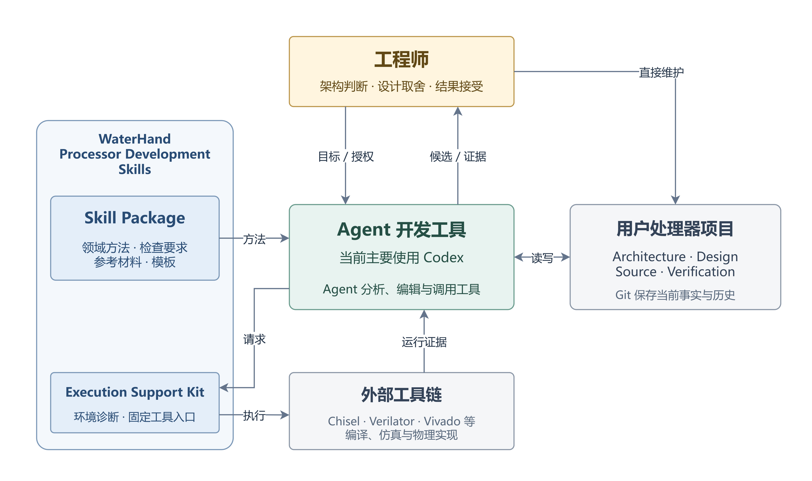
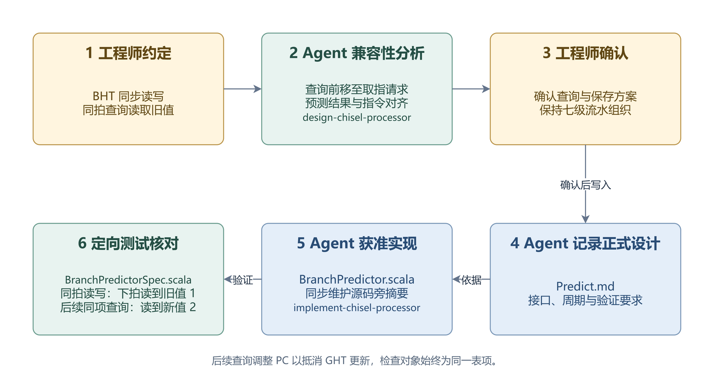

# WaterHand Processor Development Skills 设计文档

日期：2026 年 9 月 6 日

产品版本：v3.0.3

作者：计算机科学与技术学院 付家乐

> 第 1 页：封面使用上述产品名、“设计文档”标题及作者信息，插入 [产品标识](figures/logo.png)。

## 目录

> 第 2 页：目录及页码由 LaTeX 排版生成；摘要自第 3 页开始。

- 摘要
- 1. 应用场景与设计目标
- 2. 设计思路与总体架构
- 3. Skill 体系与关键方法设计
- 4. 执行支撑与工程实现
- 5. 产品有效性验证
- 6. 产品完成情况与适用边界
- 附录 A 术语约定

## 摘要

处理器开发需要工程师持续判断流水线组织、状态所有权以及性能、时序和验证成本之间的取舍。围绕这些判断，大量工作具有可重复的方法：追踪跨模块信息、检查周期行为、维护设计文档、落实接口修改、编写定向测试和核对实现证据。这些工作需要熟悉处理器设计，也会持续占用工程师的注意力。

WaterHand Processor Development Skills 将这些开发经验整理为六项可组合的 Skill，并提供 Windows 环境诊断、工具调用和安装打包脚本。工程师提出目标、确定方案并决定是否接受结果，Agent 则在授权范围内使用 Skill 完成分析、文档、实现与验证工作。产品可接入支持相应能力的 Agent 开发工具，当前主要基于 Codex 使用和验证，工程事实保存在用户项目文件及 Git 历史中。

本文说明产品的设计思路、功能划分、关键方法和工程实现，并通过三项实验考察其表现：顺序双发射处理器开发对照实验、分支预测增量开发对照实验，以及人类工程师主导的完整分支预测开发流程。前两项使用同等配置的 Codex 代理设计师，以控制设计师变量；第三项展示产品预期的人机协作方式。现有结果支持对具体任务中的工程产出、资源代价和协作过程作出分析，对普遍效率收益和人类认知负担的定量结论仍需进一步评测。

## 1. 应用场景与设计目标

### 1.1 处理器项目中的工程负担

处理器课程、CPU 设计竞赛和科研原型开发往往由规模有限的团队完成。一次微架构修改可能同时涉及多个模块、异常处理和测试。例如，增加分支预测后，处理器会提前选择可能执行的指令路径，设计需要说明预测如何更新、结果如何随指令传递，以及预测错误时如何撤销相关操作。局部模块的代码能够编译，只完成了其中一部分工作。

随着设计推进，工程师需要将讨论中的决定写入正式文档，把接口变化同步到所有使用位置，并将测试结果绑定到具体实现。文档和实现长期不一致时，后续维护者容易依据过时的状态或协议作出修改。直接让 Agent 阅读整个工程，也可能产生范围过大的搜索、重复分析和缺少出处的判断。

处理器工程中已有相对稳定的分析顺序、反例类型和检查办法，可以用来约束 Agent 的工作范围及产出。将这些经验写成可执行的步骤和检查要求后，工程师便可按任务交由 Agent 分析与实施，通过候选方案和证据判断结果，将主要精力用于架构判断与设计。

### 1.2 方法来源与通用化

本产品以在龙芯杯处理器开发中积累的工程经验为基础，将设计审查、硬件实现和时序分析中的工作流程与检查要求提炼为初始 Skill。

提炼过程中，具体项目的模块、信号和实现参数保留在原工程中，Skill 则说明完成一类任务时应当读取哪些材料、检查哪些问题，以及如何验证结果。工程师可以将这些 Skill 用于自己的处理器项目，结合已有设计选择适用的规则，并继续决定处理器目标与实现方案。

### 1.3 产品目标

本产品希望降低工程师在资料追踪、设计核对、文档维护和实现验证等重复工作上的投入，使其能够将主要精力用于架构判断与设计。Skill 将这些工作组织为 Agent 可以遵循的步骤和检查要求，帮助工程师在既定目标下推进更多设计与实现任务。

工程师可以根据项目需要选择使用范围，并通过设计文档、源码和验证结果检查 Agent 的产出，持续掌握方案选择与开发进度。

## 2. 设计思路与总体架构

### 2.1 以 Skill Package 组织开发经验

产品将开发经验整理为独立 Skill，分别定义适用任务、需要读取的材料、执行步骤、权限边界和产出要求。Codex 这一类 Agent 开发工具（harness）负责调用模型、管理会话和执行工具操作，用户可以在任务中显式指定 Skill，也可以由所用工具根据任务描述选择加载。

Agent 按 Skill 读取项目材料并调用已有工具，工程师可以继续使用自己的编辑器、Git、设计文档和构建脚本，按任务决定何时开展设计、实现或审查。产品不另建任务调度服务，开发记录继续由用户项目和所用 Agent 开发工具保存。

### 2.2 组成与职责

表 1 汇总了产品协作中各组成部分的职责及主要输入输出。

表 1 产品组成、职责与输入输出

| 组成 | 职责 | 主要输入与输出 |
|---|---|---|
| 工程师 | 提出目标、确定设计、授权修改、评估结果 | 项目约束、设计草稿、关键决定、接受或修订意见 |
| Agent 开发工具，当前主要使用 Codex | 调用模型、管理会话与上下文、编辑文件、调用工具及执行获准的子任务 | 用户任务和项目材料，输出分析、文件修改与调用记录 |
| Skill Package | 提供处理器领域方法与检查要求 | 独立 Skill、参考材料、模板和检查脚本 |
| 用户处理器项目 | 保存目标、设计、实现及验证事实 | 项目协作规则、目标与设计文档、源码、测试、运行结果与 Git 历史 |
| 执行支撑与外部工具 | 诊断环境、转发命令、编译、仿真及获取工程证据 | 工具配置和项目输入，输出退出码、日志、生成物与测量结果 |

图 1 展示各组成部分之间的协作关系。工程师发起任务后，Agent 读取项目约束与相关材料，按 Skill 的方法分析或修改，并调用确定性工具取得证据。工程师根据候选、证据和残余问题作出下一步决定，也可直接维护项目材料。实际开发可以在这些环节之间反复迭代。

图 1 产品总体架构

### 2.3 工程事实与权限边界

用户项目将处理器性质与目标写入 Architecture，将具体模块、接口、状态与周期约定写入 Design，以源码（Source）保存当前实现，以 Verification 保存验证方法和证据。项目根目录的 `AGENTS.md` 规定本地协作方式，Skill 则提供跨项目复用的分析和检查规则。

用户明确决定与当前正式项目材料共同构成工作依据。一般讨论中的新表述先作为修改意图处理，避免临时想法直接覆盖既有设计。Agent 发现冲突时，应分别说明目标、当前文档、实现行为与证据，交由有权决定的人处理。

同一规范性事实由一份文档完整定义，其他位置通过摘要和链接引用。源码旁摘要用于快速理解实现，不能替代 Architecture 或 Design。即使会话历史不可用，后续工作仍应能够从项目文件恢复事实；当前产品不额外建立处理器数据模型、审批数据库或长期工作流账本。

这些权限规则主要通过项目提示词、Skill 指令和任务授权执行。文档检查器能够发现部分结构错误，编译器和测试能够检查相应程序行为。架构合理性、遗漏的设计路径以及证据是否足以支持结论，仍需工程师和审查过程判断。

### 2.4 Agent 开发工具接入与模型调用

Skill Package 可接入具备相应 Skill 加载、项目文件访问和工具调用能力的 Agent 开发工具。当前主要围绕 Codex 完成安装适配、使用说明和验证，并提供对应插件包；接入其他工具时，需要按其接口核对 Skill 加载、命令执行和权限要求。

以 Codex 为例，用户在自己的项目中提交任务，Codex 将任务、所加载的 Skill 和相关项目材料组织为模型上下文，调用模型开展分析，再执行获准的文件修改或工具操作。配套脚本负责连接硬件工具链，不直接实现模型 API 客户端。

模型选择、账户认证、网络配置和操作权限由用户在所选 Agent 开发工具中设置。交付包不附带模型权重、账户或 API 凭据，也不提供独立的 Agent 执行服务。

## 3. Skill 体系与关键方法设计

### 3.1 功能划分

六项 Skill 按工程责任划分，典型任务及交付边界见表 2，用户可按任务分别使用或组合调用。其中，`design-chisel-processor` 与 `implement-chisel-processor` 面向 Chisel 工程。Chisel 用于描述数字硬件，生成的 RTL 代码交由编译、仿真或物理实现工具处理。

表 2 六项 Skill 的任务、产出与职责边界

| Skill | 典型任务 | 主要产出与边界 |
|---|---|---|
| `bootstrap-processor-project` | 建立或比较项目协作规则 | 仅处理项目根目录 `AGENTS.md`；已有规则先比较，经授权后增量修改 |
| `organize-processor-docs` | 搭建、撰写、重组和审查工程文档 | 文档职责、事实归属、阅读路径、长度预算和结构检查 |
| `design-chisel-processor` | 设计和审查微架构 | 字段语义、周期关系、状态生命周期、反例、候选比较与验证要求 |
| `implement-chisel-processor` | 实现、审查和验证 Chisel RTL | 接口迁移、源码、源码旁摘要、断言、定向测试和实际执行结果 |
| `trace-vivado-timing-to-rtl` | 分析具体路径或整体时序分布 | 将物理时序证据映射到 RTL 与 Chisel，形成候选修改方向；默认只读 |
| `optimize-chisel-fpga-timing` | 实施并验证时序优化 | 周期契约、最小结构修改、功能回归及相同约束下的实现比较 |

新项目可以通过 `bootstrap-processor-project` 建立 `AGENTS.md`，将证据优先、用户授权和事实归属等规则作为协作基线；文档体系的搭建由 `organize-processor-docs` 负责。写入后的规则和文档均由用户项目维护，后续包版本不自动覆盖。环境配置另由脚本处理。

### 3.2 Skill 的文件组织与按需读取

为使 Agent 按当前任务读取必要规则，每项 Skill 将适用范围、执行步骤和必要检查集中在入口文件 `SKILL.md`，通过链接引用目录内的详细规则、案例与模板。入口给出阅读顺序，详细材料按任务展开，便于用户审阅和维护方法，也减少无关规则进入上下文。

例如，`organize-processor-docs` 在入口中区分搭建文档体系、撰写正文和维护已有材料三类任务，再按文档类型引用相应规范。整理一个模块的文档时，Agent 读取相关组织要求和写作规则，并结合该模块的项目材料开展工作；时序分析等其他任务的材料保留在各自 Skill 中，按需使用。

### 3.3 微架构设计与审查

处理器设计中的接口、状态和周期条件相互关联，一处选择可能影响多个模块。`design-chisel-processor` 将这些关联检查组织为可重复的分析过程，支持工程师从设计问题、草稿或现有实现出发，形成方案、比较候选和审查设计。

Agent 先明确字段含义及其生产、使用和更新位置，再沿指令或请求的生命周期核对周期关系，检查正常执行、流水线停顿和异常处理。由此形成的接口约定和状态变化说明，帮助工程师判断方案能否与现有流水线配合，以及哪些条件仍需确定。

例如，一条指令因流水线停顿而连续保留数拍时，Agent 需要检查它是否会重复修改本应只更新一次的状态。发现风险后，还要核对已有控制逻辑是否消除了这种可能，并写出问题成立的条件，避免仅凭局部代码作出结论。

涉及架构取舍时，Agent 比较完整候选方案的正确性条件、性能预期和实现成本，将问题依据与待决事项交给工程师。工程师确定方案后，Agent 将相应约束及验证要求写入设计文档，供后续实现和测试使用。重复的关联核对据此交由 Agent 推进，工程师集中判断方案及其代价。

### 3.4 人类与 Agent 共同维护的文档范式

工程师与 Agent 交替修改项目时，需要依据同一份正式材料理解设计。`organize-processor-docs` 以可直接阅读和编辑的 Markdown 组织文档，为每项规范性事实指定唯一的归属文档，其他位置通过摘要和链接引用。人类可以直接修订正文，Agent 也沿同一组文档开展后续分析，设计依据由用户项目及其 Git 历史保存。

该 Skill 要求将正式文档统一放在项目根目录 `doc/` 下，按实际材料建立 Architecture、Design、Verification 和必要的 Research。Design 以稳定硬件模块层次为目录主轴，尽量对齐源码中的模块实例与职责；协议（Protocol）、状态生命周期（Lifecycle）和架构决策记录（ADR）通过链接提供跨模块阅读路径。模块边界由工程师决定，文档说明与实现拓扑存在的合理差异。

文档随稳定模块和独立问题逐步增加，避免预先生成空目录。阅读路径和长度预算共同限制单次查阅负担：Architecture 与 Design 的相应正文应从各自入口两条文档链接内可达；超出目标长度时，先检查重复背景和无关细节，再按稳定职责判断是否拆分。当前预算属于待项目评测的写作策略，硬阈值可配置，复杂表格和状态机保留必要语义。

解释 Chisel 接口时，Agent 先列出最小 Scala 声明，再按字段顺序说明含义、有效条件和使用约束，使读者能够对照接口核对语义。Scala 是 Chisel 使用的编程语言；接口之外，仅在文字、表格或图无法准确表达所需硬件结构时保留必要片段，完整源码留在实现文件中。

配套检查器覆盖链接、阅读深度、长度预算等结构条件。 文档中的周期约定和设计关系由 Agent 结合项目材料审查，涉及具体设计分析时配合使用 `design-chisel-processor`。两项 Skill 分别约束信息组织与处理器语义，共同支持工程师查阅、修订和复核设计。

### 3.5 从已确认设计到实现和验证

一项接口修改可能分散在多个模块、存储结构和测试中，逐处落实设计需要反复核对。`implement-chisel-processor` 要求 Agent 以已确认的 Architecture 和 Design 确定修改范围与验收条件；未明确的周期或接口问题先进入设计分析，必要的选择确定后再开始实现。

围绕变化的字段，Agent 从接口数据结构（Bundle）的定义追踪到构造位置、寄存器、队列和所有读写方，并同步检查相关测试。例如，字段已经加入接口而某一级未继续传递，会留下编译或局部测试未必覆盖的集成缺口。全路径核对将这种分散的维护工作纳入同一次修改。

实现还需要控制新增硬件的范围。Agent 在加入条件、寄存器或选择器前，检查现有约束是否已提供相同保证；由上游保证的条件可以通过断言核对，避免在多个下游重复增加保护逻辑。涉及程序可见行为或周期边界的设计修订，按工程师授权处理。

为了便于工程师理解实现并回查设计，任务中每个新增或修改的项目自有 Scala 文件，都必须同步维护同目录的 `<SourceBase>_codex.md`。摘要记录实现职责、设计链接、接口与周期行为，以及验证证据和残余风险。缺失或陈旧的必要摘要属于未完成工作，摘要随源码一同交付和维护。

Agent 根据设计约束编写断言和定向用例，记录编译与动态验证的实际命令、退出状态和结果，并标明尚未验证的行为。工程师可以将源码、摘要和测试证据对照检查，判断已确认设计是否完整落实，以及后续还需补充哪些验证。具体调用方式与可选核验配置见用户指南。

### 3.6 物理时序分析与优化

物理时序报告中的单元和连线需要结合源码解释，工程师才能判断哪些结构值得修改。`trace-vivado-timing-to-rtl` 规定了从 Vivado 原始路径逐段追踪到生成 RTL、Chisel 和流水线语义的方法，支持具体路径分析、全设计审查及不同运行的比较。Agent 据此定位瓶颈，形成有证据的候选修改方向；该 Skill 默认只读。

分析按任务范围比较逻辑延迟、布线延迟和相关路径，区分测量结果、源码映射与推断，并将结论绑定到对应源码和运行条件。Agent 同时整理候选方向的影响范围、实现代价和验证需求，供工程师确定优化优先级及允许修改的范围。

工程师确定优化范围后，Agent 可使用 `optimize-chisel-fpga-timing` 实施修改。该 Skill 依据已确认的周期约定选择必要的结构调整，覆盖组合逻辑、选择结构、寄存边界和高扇出控制路径等任务。例如，移动寄存边界时，需要核对数据与控制是否仍然对应，并检查停顿和清除行为，防止时序修改改变功能语义。

修改后，Agent 检查生成 RTL 并运行功能回归，再在可比器件和约束下进行物理实现，比较时序与资源结果。交付材料保留修改位置、测试结果及前后运行条件，工程师据此评估收益和代价，决定是否接受该项优化。

### 3.7 产出检查与责任分工

各项 Skill 将分析依据、修改位置与验证结果的记录方式纳入交付要求，工程师可以沿项目文档和源码链接逐项复核。Agent 结合设计语义检查关联关系，文档检查器处理链接和阅读路径等结构条件，编译与仿真工具检查相应实现行为，物理工具提供时序和资源数据。

Agent 交付结果时，说明哪些设计要求已有证据支持，哪些行为仍待验证，以及哪些事项需要工程师决定。工程师据此作出架构取舍、提出修订要求并决定是否接受结果，持续掌握设计方向与开发范围。

## 4. 执行支撑与工程实现

### 4.1 环境契约与固定入口

配套的环境契约与工具脚本合称 Execution Support Kit，为 Agent 提供环境探测和重复工具操作的固定入口。版本要求、探测命令和恢复提示集中在 `environment/toolchains.json`；诊断命令 `doctor` 按打包、Chisel 或 Vivado 等工作类型检查依赖，用户可通过 `PROCESSOR_SKILLS_*` 配置变量指定工具路径。

产品当前运行平台为 Windows x86-64，MSYS2 UCRT64 作为其内部编译工具链。脚本只准备单次命令的进程环境，不修改全局 `PATH`，不安装 Vivado 或写入许可证。缺失工具通过诊断结果交给用户处理，各脚本入口及工作范围见表 3。

表 3 执行支撑脚本入口与工作范围

| 入口 | 工作范围 |
|---|---|
| `scripts/initialize.cmd` | 从完整源码仓库执行预检、校验、测试、构建与插件安装 |
| `scripts/doctor.cmd` | 报告工具路径、版本、缺失项与恢复提示 |
| `scripts/read-text.cmd` | 显式按 UTF-8 读取文本，报告编码错误 |
| `scripts/run.cmd check-docs` | 检查用户项目的文档结构与长度预算 |
| `scripts/chisel-run.cmd` | 为用户项目的 Chisel 命令准备工具链与进程环境 |
| `scripts/build.cmd` | 校验、运行工具测试并构建可复现安装包 |

对已经收到 ZIP 的用户，安装入口是包内本地 marketplace 的注册和插件安装。源码构建命令依赖源码测试等材料，包内 README 对这两条路径分别说明。

### 4.2 Windows 命令与路径处理

为避免多层 Shell 转发改变空格、引号或特殊字符，当前 CMD 入口保存原始 Windows 参数，由 Python 使用 `CommandLineToArgvW` 解码一次，再通过参数数组传递给后续命令。Chisel 运行结果分别记录请求命令、解析命令、实际启动命令和真实子进程退出码，便于定位失败发生在哪一层。

为衔接 Chisel 生成的构建文件与 Windows 工具，配套脚本按源码 hash 构建 `which` 和 Make 适配器，处理工具查找、路径分隔符以及 C++ runtime 等差异。包含空格、非 ASCII 字符或较长根路径的用户项目，可以在单次运行中使用临时 `subst` 别名，并通过 `CHISEL_PROJECT_ROOT` 约束生成目录位置。命令结束后释放别名。

当前包或源码仓库自身的完整路径仍须使用 ASCII 字符。中文包路径可能导致原生适配器在进入 Chisel 仿真前编译失败；这一限制与用户项目路径适配的范围不同。已有交付验收记录了 ASCII 包路径下中文及长项目路径的成功运行，中文包路径作为已知限制公开说明。

### 4.3 可追踪的执行结果

支撑层通过结构化结果提供工具探测、参数解析和命令退出信息。顶层退出码区分完成、缺少工具、配置或结构错误以及外部命令失败；具体子进程状态继续保留。日志、缓存、生成 RTL 和仿真结果进入指定运行目录。

工程师需要分别查看编译、单元测试、程序运行和物理时序的结果，确认每项结论实际由哪些证据支持。安装和环境探测没有覆盖原生适配器的实际编译，因此这两个入口成功后，后续命令仍可能遇到构建问题。

### 4.4 打包与工具级验证

打包脚本使用明确的文件集合，包含插件、六项 Skill、运行工具、环境契约、脚本和用户文档。源码级测试、产品计划、报告、缓存及实验结果不进入运行包。包内 README 从面向交付用户的 `PACKAGE_README.md` 生成，避免解压用户误用源码构建流程。

构建统一文本换行、文件顺序、ZIP 时间戳和属性，并生成 `PACKAGE_MANIFEST.json`，记录产品版本、许可证、源码状态与文件校验信息。相同输入可重复得到相同 ZIP。正式构建默认要求干净工作树，开发构建需显式允许未提交状态。

2026 年 9 月 6 日本稿核对时，六项 Skill 结构校验通过，工具测试共 35 项，33 项通过、2 项按条件跳过。跳过项涉及需显式启用的真实 Chisel 路径，不能计作本轮已执行通过。测试覆盖插件元数据、命令转发、环境诊断、打包内容和可复现性等工具行为。

另外，已有指定 ZIP 的运行验收记录覆盖 ASCII 包路径下的中文和长项目路径、环境诊断及六项 Skill 校验。该记录与当前源码测试分别绑定各自输入，不能合并表述为当前所有平台组合均已验收。

## 5. 产品有效性验证

### 5.1 评估目标与实验安排

本章评估 WaterHand Processor Development Skills 能否为工程师推进处理器设计提供有效的工程支撑。评估关注 Agent 能否承担方案中的关联分析、实现与验证工作，将架构目标落实为可检查的工程产出，以及工程师能否持续掌握方案选择，把主要精力用于架构判断与设计。

围绕这一目标，本项目通过三项实验分别检查复杂设计的工程实现支撑、增量开发的工程一致性，以及真实的人机协作效果，评估问题与判断依据见表 4。

表 4 产品有效性评估问题与实验安排

| 评估问题 | 对应实验 | 主要判断依据 |
|---|---|---|
| Skill 能否为复杂处理器方案提供更充分的工程实现支撑 | 顺序双发射处理器开发对照 | 跨模块、跨周期关联工作的完成情况，功能验收与 CoreMark 仿真性能 |
| Skill 能否支持不完整方案的补全与相关工程材料的同步维护 | 分支预测增量开发对照 | 设计与实现完成情况、定向测试及正式文档一致性 |
| 工程师能否持续掌握架构选择，将关联工程工作交给 Agent | 人类工程师主导的分支预测开发 | 工程师决定与 Agent 分析、文档、实现和验证之间的对应关系 |

本产品在实际使用中由工程师提出目标、作出架构取舍并评估结果，Agent 承担获准的工程工作。为比较 Skill 对工程产出的影响，前两项实验采用同等配置的 Codex 主会话模拟设计师角色，称为代理设计师。这样可以减少不同人类工程师的经验、偏好，以及同一工程师重复完成任务时的学习效应对比较的影响。

两组使用相同的项目输入、任务要求与工具条件。代理设计师在预设目标和约束内选择方案、组织工程子任务并复核产出，工程子任务承担相关分析、文档、实现和测试。Skill 组的主会话与工程子任务均可使用本产品 Skill，Control 组的对应角色均禁止读取本产品。

这一代理安排服务于对照评测，结果反映整个实验团队在方案选择和工程执行上的综合表现。第三项实验由真实工程师承担设计师职责，主导架构判断、授权实现并评估结果，展示工程师如何使用 Skill 支持自己的设计与开发过程。

功能验收检查处理器是否满足既定行为要求；性能采用 CoreMark 的 performance 和 validation 两个工作负载，以平均每周期退休的指令数（IPC）比较执行效率；工程一致性审查检查正式设计与实现是否相符。

实验分别核对 Skill 的实际读取记录和最终产出，前者用于确认方法是否进入任务上下文，后者用于检查工程任务的完成情况。详细运行条件、完整指标和验证范围集中在随附的[《实验补充说明》](EXPERIMENT_SUPPLEMENT.md)，供进一步查阅。

### 5.2 顺序双发射开发对照：复杂设计的工程实现支撑

#### 5.2.1 评估目的与任务

为评估 Skill 能否为处理器设计提供更充分的工程实现支撑，第一项实验考察 Agent 能否完成跨模块、跨周期的关联工作，并将架构目标落实为通过验证的实现。两组从同一架构目标和构建骨架出发，完成顺序双发射处理器，保持双发射目标、七级流水角色、指令集对外行为和顶层接口。

实验允许代理设计师自行选择实现，比较结果同时包含方案选择和工程执行的影响。实验从同一起点开展两次独立的成对运行，下文分别称为第一次对照和第二次对照。组织者对四个交付实现分别执行相同的 15 项独立检查，包括 13 个定向场景和两个 CoreMark 工作负载，并结合源码解释性能差异。

#### 5.2.2 结果与有效性判断

四个实现均通过全部独立检查，Skill 组在两次运行中都取得了明显更高的 CoreMark IPC。表 5 汇总独立检查结果与 IPC 增幅，增幅范围来自两个工作负载，逐工作负载数据见《实验补充说明》表 S1。

表 5 顺序双发射对照的独立检查结果与 IPC 增幅

| 保留样本 | 独立检查，Skill / Control | Skill 相对 Control 的 CoreMark IPC 增幅 |
|---|---|---|
| 第一次对照 | 15/15 通过 / 15/15 通过 | 34.93% 至 35.21% |
| 第二次对照 | 15/15 通过 / 15/15 通过 | 46.62% 至 46.70% |

在两个样本中，Control 均采用粗粒度串行化，允许组内双发射，下一指令组需等待旧组离开后端，以此减少需要协调的跨组依赖和并发状态。Skill 均完成了更复杂的跨级数据转发（forwarding），协调结果就绪、转发优先级和停顿控制，使不同指令组能够在流水线中重叠执行。

跨级转发中的结果来源、指令先后关系和有效时点，需要在多个模块间反复核对，并与停顿控制共同实现。Skill 组完成了这些关联工作，通过相同功能验收，将流水线重叠的设计意图落实为仿真性能收益。这里的复杂度用于说明实现架构目标需要承担的工程工作，性能与验证结果体现这些工作的价值。

这两个保留样本表明，Skill 能够支持 Agent 承担复杂方案中的关联分析与实现工作，为推进具有明确性能收益的架构方案提供工程支撑。这一能力为工程师将重复核对、实现与验证交由 Agent 处理提供了条件；第 5.4 节进一步考察真实工程师如何运用这些能力，在主导架构判断的同时推进实现。

### 5.3 分支预测增量对照：方案补全与工程一致性

#### 5.3.1 评估目的与任务

已有处理器中的一次修改，需要补全新增功能的设计条件，同时维护受影响的接口、控制关系和正式文档。为评估 Skill 对这类增量开发的支持，第二项实验向两组提供同一份可运行处理器和分支预测草稿，要求独立完成设计、实现与验证，并保持原有流水线和双发射能力。

草稿规定了包含 128 项的分支历史表（BHT）和 7 位全局分支历史状态（GHT），查询结果的保存与采用、预测错误恢复、状态更新及停顿处理等细节仍待明确。两组继承第一项实验中同一份实现与工程材料，未获得人工案例后续确定的设计答案。Skill 组实际读取了 `design-chisel-processor` 和 `implement-chisel-processor`。

#### 5.3.2 结果与有效性判断

两组均完成预测、恢复与训练功能，通过 24 项外部场景、新增测试的独立复跑和组织者追加探针。两组 CoreMark IPC 相对共同基线均提高约 13.5% 至 13.9%，彼此差距很小。功能实现由源码、预测状态测试和整核检查共同核对。

正式文档审查发现，Control 的 Architecture 仍保留旧的集中仲裁要求和已经不存在的状态，与新增的前端本地预测重定向相冲突。后续维护者若沿用这些条款，会依据错误的状态归属和恢复关系修改工程。Skill 同步修订了相关历史条款，使正式设计与当前实现保持一致。

最终验收包含功能要求和文档一致性要求。Skill 通过完整验收，Control 因文档一致性缺陷未通过完整验收，其功能检查通过。具体判定与验证范围见《实验补充说明》第 3 节。

这项实验中，两组均能将不完整草稿发展为可运行功能，Skill 组进一步完成了受影响正式材料的同步维护。在功能和性能接近的条件下，这一差异体现了更完整的工程交付，支持 Skill 对增量开发中跨文档一致性维护的作用。

### 5.4 人工主导开发：架构判断与工程执行的协作

#### 5.4.1 评估目的与场景

产品面向工程师主导的开发，需要验证工程师能否持续决定方案，并让 Agent 承接由这些决定引出的关联工程工作。第三项实验据此开展真实的分支预测开发，检查工程师的输入如何经过分析、确认和实施，最终形成可以核对的设计、源码与测试。

工程师接管第一项实验留下的可运行处理器，继续原 Codex 会话，明确由自己作出架构判断。工程师先要求调用 `organize-processor-docs`，按模块拓扑整理前后端设计材料，并决定拆分分支处理和算术逻辑模块；随后提交自己的预测草稿，要求 Agent 先审查未决问题，待确认后推进。

#### 5.4.2 架构决定如何落实为工程约束

Agent 使用 `design-chisel-processor`，结合既有流水线分析草稿中的历史更新、预测信息传递和训练时点。工程师根据分析选择已解析分支历史，确定两条指令共享同一份历史，并规定分支实际向下一级推进时才训练、异常分支不参与训练。工程师决定预测策略及其复杂度，Agent 负责整理影响这些选择的周期条件与候选后果。

在预测表的访问方式上，工程师要求 BHT 同步读写，且同拍写入不影响本次查询结果。Agent 核对现有流水线后指出，同步读取需要经过时钟边界，原先在译码级当拍查询并使用结果的描述需要修订。

Agent 提议在取指请求发出时查询预测表，将下一拍返回的结果与对应指令对齐；指令响应较晚或流水线停顿时，保留结果和对应关系。方案利用已有流水线边界，保持七级组织，并明确同一表项被同时查询和更新时读取旧值。

工程师确认后，Agent 将这些约定整理进正式的 `Predict.md`，说明接口、结果保存、状态更新和验证要求。图 2 以同拍读旧值约定为例，归纳工程师决定经过兼容性分析、确认和获准实施，形成设计与验证证据的过程。

图 2 BHT 同拍读旧值约定的落实过程

#### 5.4.3 实现结果与协作效果

工程师授权按当前 `Predict.md` 实现后，Agent 使用 `implement-chisel-processor` 修改预测器及相关流水级，同步维护源码旁摘要，完成编译和验证。查询结果与指令的对应关系贯穿前端、指令载荷和后端训练，各处修改依据同一份已确认设计开展。

针对工程师确定的读旧值语义，`BranchPredictorSpec.scala` 在同一拍提交查询与更新，检查下一拍返回旧值 1；后续调整 PC 以抵消 GHT 变化，再查询同一表项，检查新值 2。工程师的周期约定因此具有明确的设计出处、实现位置和测试期望，可以逐项检查。

保留的五项 Scala 测试均通过，外部功能场景合计 15 项通过。两个 CoreMark 工作负载的 IPC 分别由 0.303263、0.303437 提高到 0.345319、0.344987，反映了条件分支预测与静态直接跳转等整体改造的仿真效果。完整计数见《实验补充说明》表 S7。

工程师在复跑后要求 Agent 只读评估收益、未覆盖场景及进入物理实现前需要决定的事项，并保留接受与后续工作的决定权。开发记录覆盖了草稿审查、架构选择、正式设计、获准实现及验证后的评估。

这一案例验证了产品在人类主导流程中的可用性：工程师提出并修订方案，Agent 将决定涉及的关联分析、文档、实现和验证持续推进。工程师可以通过具体问题和证据掌握开发过程，设计选择与实际工程产出之间保留了可追踪的对应关系。

### 5.5 有效性结论与适用范围

顺序双发射对照中，Skill 组完成了跨级转发及相关控制，为流水线重叠和性能目标提供了实现支撑；分支预测对照中，Skill 组交付了功能与正式文档一致的增量实现；人工案例中，工程师持续掌握架构判断，Agent 完成了由这些决定引出的工程工作。三项结果共同支持产品在已测任务中的有效性。

我们据此认为，WaterHand Processor Development Skills 的潜在价值在于扩大工程师的实现带宽。通过 Skill 组织 Agent 承担关联分析、文档维护和实现验证，工程师能够围绕架构目标推进更复杂的方案，将主要精力用于架构判断与设计。

两项对照中，Skill 组取得上述产出时的 Token 消耗均高于 Control，完整任务用时未呈现稳定优势，详细计数与统计口径见《实验补充说明》第 2、3 节。性能结论均限定为 RTL 仿真下的 CoreMark IPC，物理频率、面积和功耗未测量。

上述判断针对现有保留样本。人工案例采用开发过程中保存的仿真结果，工程师尚未作出最终接受决定，验证范围见《实验补充说明》第 4 节。更广泛任务中的平均收益，以及工程师节省的时间与认知投入，留待后续重复实验和真实用户评测量化。

## 6. 产品完成情况与适用边界

### 6.1 当前交付内容

当前产品提供六项 Skill、Codex 插件元数据、项目协作基线、环境契约、Windows 工具脚本、文档检查器、用户指南和可复现打包逻辑。工具级测试和指定包的运行记录能够支持安装及执行支撑方面的检查，三项实验提供了设计、实现、文档与验证过程的工程案例。

产品方法以可读文件交付，用户可以查看规则、选择适用任务，并在自己的项目中维护 Architecture、Design、源码和验证材料。迁移到新项目时，需要由用户明确目标与本地约束；通用包不会自动提供该项目的架构答案。

### 6.2 自研贡献与外部依赖

本作品的贡献集中在处理器开发经验的提炼、Skill 的职责与参考材料组织、人类和 Agent 共同维护的文档范式，以及配套的确定性工具脚本。模型调用、会话和工具执行由接入的 Agent 开发工具承担，当前主要使用 Codex；Chisel、firtool、Verilator 和 Vivado 等工具负责硬件编译、仿真或物理实现。示例处理器属于实验工程，独立于通用 Skill Package。

产品的代码、Skill、模板和文档采用木兰宽松许可证第 2 版，标识为 `MulanPSL-2.0`。第三方材料、外部工具和用户项目遵循各自许可证，模型访问由使用者准备。

### 6.3 已知限制与后续评测

当前支持环境为纯 Windows，Chisel 工具包位置要求完整 ASCII 路径。真实工程仍可能遇到模型服务、工具版本、沙箱权限或外部许可证问题，环境诊断与失败日志用于定位这些边界。

使用时需要结合明确的任务范围、可定位的项目材料和结果复核，检查 Skill 是否被加载并完整遵循，不能仅依赖自动触发。模型可能忽略规则或误读材料，有限测试也可能遗漏执行路径。本文未提供形式化证明；处理器实验未执行综合和布局布线，时序优化方法也没有在这三项实验中形成物理收益证据。

后续评测可增加固定任务和重复运行，交替或预先随机安排组别顺序，并分别比较方法加载、工程质量和资源成本。若需要量化产品对人类工程师的价值，还应记录真实设计任务中的查阅时间、决策依据、返工和主观负担，形成可比的人工使用研究。相关评测属于下一步工作。

## 附录 A 术语约定

本文使用的主要术语及其含义汇总于表 A.1。

表 A.1 本文术语及含义

| 术语 | 本文含义 |
|---|---|
| WaterHand Processor Development Skills | 本作品的正式产品名，正文可简称产品或 Skill Package |
| 工程师 | 实际用户，拥有目标、架构取舍和接受决定；对照实验中由 Codex 代理此角色 |
| Agent | 通过模型分析任务、读取材料并调用工具的任务执行者 |
| Agent 开发工具（harness） | 提供模型调用、会话管理、文件操作和工具执行等能力的软件，当前主要使用 Codex |
| Skill | 可复用的任务方法、输入输出要求、权限边界及参考材料 |
| Architecture / Design | 处理器性质与目标 / 具体模块和周期设计，两者分别维护 |
| RTL | Register-transfer level，寄存器传输级实现 |
| BHT / GHT | BHT 为分支历史表；GHT 沿用项目字段名称，在本案例中指保存 7 位全局分支历史的状态 |
| IPC | Instructions per cycle，本实验为退休指令数除以测量周期数 |
| fire | 相应握手或阶段实际接受事件，具体定义由用户项目接口决定 |
| Token | 模型请求中的计数单位，本文注明主会话或工程团队口径 |
